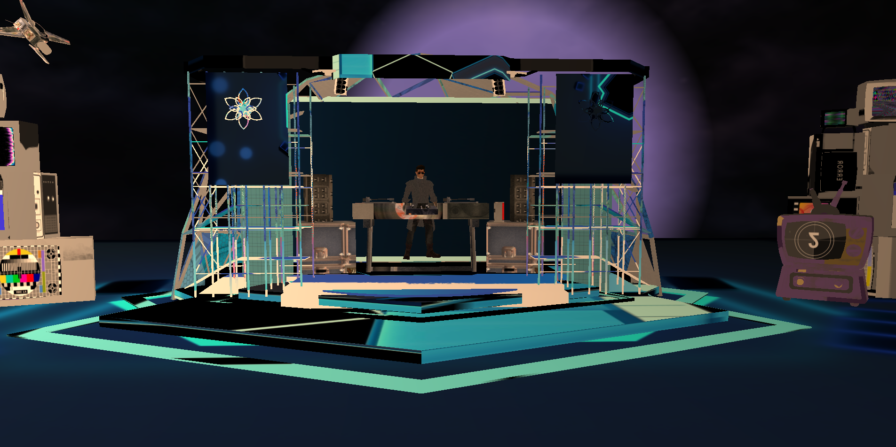

# **VrLand**

## **Visión:**

Ser la empresa líder en experiencias de entretenimiento digital, llevando la magia de los conciertos a cualquier rincón del mundo a través de la tecnología de simulación virtual. Buscamos redefinir la industria musical al conectar a los fans con sus ídolos, ya sean VTubers, artistas digitales o leyendas que han dejado un legado imborrable.

## **Misión:**

Ofrecer conciertos virtuales innovadores y de alta calidad, utilizando tecnología de punta en modelado 3D, inteligencia artificial y realidad extendida para brindar experiencias inmersivas e inolvidables. Nuestro objetivo es acercar a los fanáticos a sus artistas favoritos, preservando el legado de músicos icónicos y potenciando la nueva era del entretenimiento digital.

